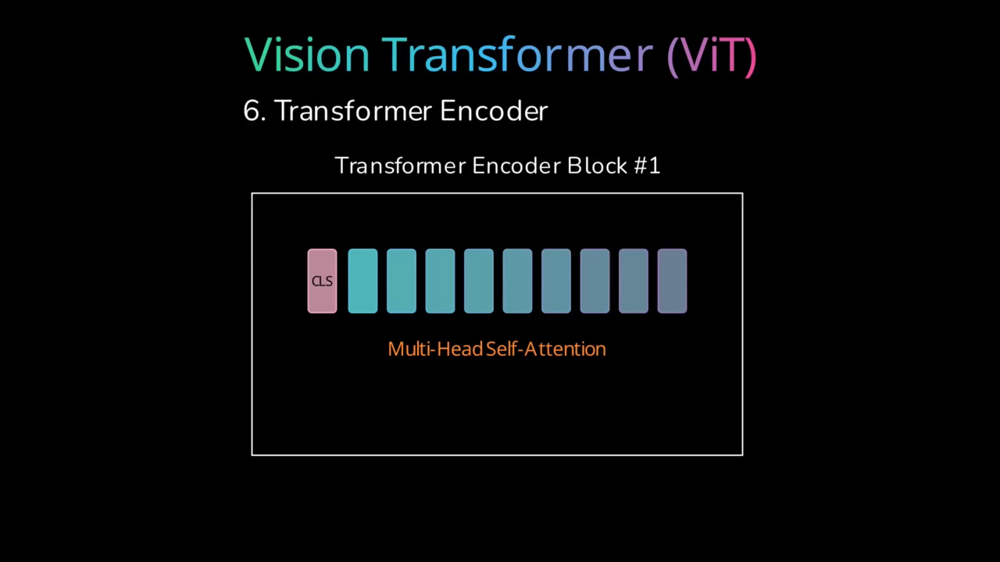

# ViTAX: A Vision Transformer in JAX

This repository contains the source code for [ViTAX: Building a Vision Transformer from Scratch](https://maurocomi.com/blog/vit.html), a project implementing a Vision Transformer (ViT) using JAX and the NNX library. For a comprehensive explanation of the Vision Transformer architecture, the JAX/NNX implementation details, and a step-by-step walkthrough of the code, please refer to the blog post.

The project focuses on understanding each component of the ViT architecture and demonstrates how to build and train it for an image classification task using the "Matthijs/snacks" dataset from Hugging Face.

<div align="center">
  <a href="https://www.youtube.com/watch?v=ywzPAurbc1s&ab_channel=MauroTechChannel" title="Click to watch the full video on YouTube">
    
  </a>
  <br>
  <em>Click preview to watch the full video (2.4MB MP4)</em>
</div>


## Features

- Implementation of core ViT components:
    - Image Patchification (via `patchify_image` in [`src/transformer.py`](src/transformer.py))
    - Patch Embeddings ([`src.transformer.PatchEmbedding`](src/transformer.py))
    - Positional Embeddings ([`src.transformer.PositionalEmbedding`](src/transformer.py))
    - CLS Token
    - Multi-Head Self-Attention ([`src.transformer.MultiHeadAttention`](src/transformer.py))
    - Transformer Encoder Blocks ([`src.transformer.EncoderBlock`](src/transformer.py))
    - Classification Head
- Training pipeline using JAX, NNX ([`src.train.train_step`](src/train.py), [`src.train.run_training`](src/train.py)), and Optax.
- Dataset handling with Hugging Face `datasets` ([`src.dataset.HF_Dataset`](src/dataset.py)).


## Setup and Installation

1.  **Clone the repository:**
    ```bash
    git clone https://github.com/maurock/vitax.git
    cd vitax
    ```

2. **Create and activate a conda environment:**
    ```bash
    conda env create -f environment.yml
    conda activate vitax
    ```

## Data Preparation

The model is trained on the "Matthijs/snacks" dataset from Hugging Face. The [`src/dataset.py`](src/dataset.py) script handles downloading, preprocessing (resizing), and saving the dataset to disk.

1.  **Run the dataset preparation script:**
    ```bash
    python src/dataset.py
    ```
    This script will:
    - Download the "Matthijs/snacks" dataset.
    - Resize images to the configured dimensions (default 160x160).
    - Save the processed dataset splits (train, validation, test) to `data/snack_dataset.hf/`.
    - It also saves a `dataset_config.yaml` within `data/snack_dataset.hf/` which reflects the configuration used for dataset creation. *This is important* because the ViT will use this information during training.

## 🚂 Training

The training process is done in [`src/train.py`](src/train.py) script. It loads the preprocessed dataset, initializes the Vision Transformer model, and trains it using the Adam optimizer and cross-entropy loss.

1.  **Configure training parameters (optional):**
    Training hyperparameters (learning rate, batch size, number of epochs, model dimensions, etc.) are defined in [`configs/config.yml`](configs/config.yml). You can modify this file to experiment with different settings.

    Here's a working example:
    ```
    # config.yml
    # Dataset. Set this according to your dataset configuration,
    # e.g. data/snack_dataset.hf/config.yaml
    width: 160
    height: 160
    path: "snack_dataset.hf" # path containing the split under data/

    # Model
    patch_size: 16
    num_classes: 20
    num_heads: 4
    num_encoder_blocks: 8
    dim_emb: 768

    # Training
    batch_size: 32
    learning_rate: 0.0001
    splits:
    - 'train'
    - 'validation'
    - 'test'
    num_epochs: 50
    output_name: my_weights  # stored in checkpoints/
    ```

2.  **Run the training script:**
    ```bash
    python src/train.py
    ```
    This script will:
    - Load the configuration from [`configs/config.yml`](configs/config.yml).
    - Initialize the [`src.transformer.VisionTransformer`](src/transformer.py) model.
    - Load the preprocessed dataset from `data/snack_dataset.hf/` (as prepared in the "Data Preparation" step).
    - Train the model using the [`src.train.run_training`](src/train.py) function, printing loss information for each epoch.
    - The trained model state is saved under `checkpoints/`. The name of the folder is the one provided in `config.yaml` -> `output_name`


## License

This project is licensed under the MIT License. See the `LICENSE` text in [`pyproject.toml`](pyproject.toml) for more details.
